[TOC]


## **LAB 01** – *Sử dụng thuật toán Bressenham và Midpoint để cài đặt các thuật toán*

*vẽ các đường sau:*
1.1.Thuật toán vẽ đoạn thẳng (xét 4 trường hợp của hệ số góc)
1.2.Thuật toán vẽ đường tròn
1.3.Thuật toán vẽ ellipse
1.4.Vẽ các đường cong khác: parabol, hyperbol, sin(x), cos(x)
*Yêu cầu*: Sử dụng sự kiện click chuột để xác định đoạn thẳng, đường tròn,
ellipse,… cần vẽ

### **1.1 ve bang bresenham**

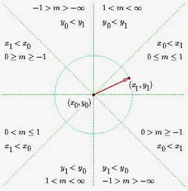


*(y-y1)/( x-x1) = ( y2-y1)/( x2-x1) hay y = mx + b*
* m = (y2-y1)/( x2-x1)*
* b = y1- m.x1*
* Δy = m Δx*

y=2x+1:

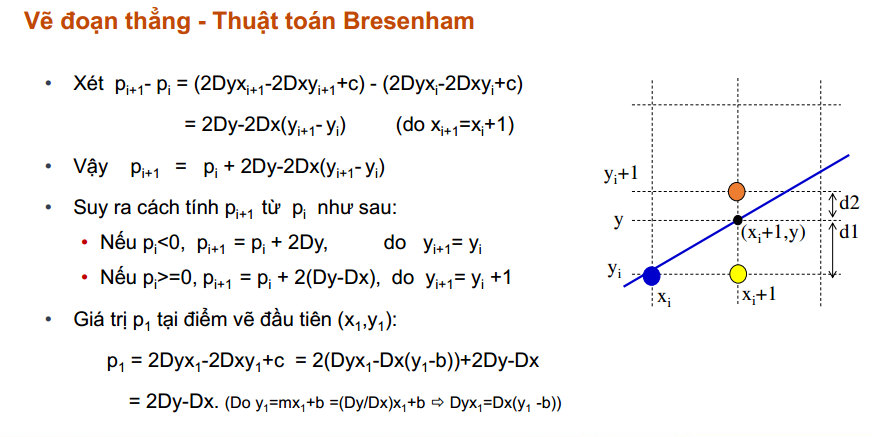


```c
#include <GL/glut.h>

#include <math.h>

#include <stdlib.h>

int ww = 600, wh = 400;

int first = 0;

int xi, yi, xf, yf;

void putPixel(int x, int y) {
  glColor3f(0.3, 0.2, 0.0); 
  glBegin(GL_POINTS);
  glVertex2i(x, y);    
  glEnd();
  glFlush(); 
}
void display() {
  glClearColor(0.4, 0.7, 0.5, 1.0);
  glColor3f(0.2, 0.3, 0.3);
  glClear(GL_COLOR_BUFFER_BIT);
  glFlush();
}

void bresenhamAlg(int x0, int y0, int x1, int y1) {
  int dx = abs(x1 - x0);
  int dy = abs(y1 - y0);
  
  int x, y;
  
  if (dx >= dy)
  {
    int d = 2 * dy - dx;
    int ds = 2 * dy;
    int dt = 2 * (dy - dx);

    if (x0 < x1)
    {
      x = x0;
      y = y0;
    } else
    {
      x = x1;
      y = y1;
      x1 = x0;
      y1 = y0;
    }
    putPixel(x, y);    
    while (x < x1)
    {
      if (d < 0)
        d += ds;
      else {
        if (y < y1) {
          y++;
          d += dt;
        } else {
          y--;
          d += dt;
        }
      }
      x++;
      putPixel(x, y);
    }
  }
  //truong hop con lai 
  else {
    int d = 2 * dx - dy;
    int ds = 2 * dx;
    int dt = 2 * (dx - dy);
    if (y0 < y1) {
      x = x0;
      y = y0;
    } else {
      x = x1;
      y = y1;
      y1 = y0;
      x1 = x0;
    }
    putPixel(x, y);
    while (y < y1)
    {
      if (d < 0)
        d += ds;
      //ve theo chieu xuong duoi
      //...  
      else {
        if (x > x1) {
          x--;
          d += dt;
        } else {
          x++;
          d += dt;
        }
      }
      y++;
      putPixel(x, y);
    }
  }

}

void mouse(int btn, int state, int x, int y) {

  if (btn == GLUT_LEFT_BUTTON && state == GLUT_DOWN)

  {
    switch (first)
    {
    case 0:
      xi = x;
      yi = (wh - y);
      first = 1;
      break;
    case 1:
      xf = x;
      yf = (wh - y);
      bresenhamAlg(xi, yi, xf, yf);
      first = 0;
      break;
    }
  }
}

void myinit() {
  glViewport(0, 0, ww, wh);
  glMatrixMode(GL_PROJECTION);
  glLoadIdentity();
  gluOrtho2D(0.0, (GLdouble) ww, 0.0, (GLdouble) wh);
  glMatrixMode(GL_MODELVIEW);
}
int main(int argc, char ** argv) {
  glutInit( & argc, argv);
  glutInitDisplayMode(GLUT_SINGLE | GLUT_RGB);
  glutInitWindowSize(ww, wh);
  glutCreateWindow("Lab1: Bresenham Line Algorithm");
  glutDisplayFunc(display);
  myinit();
  glutMouseFunc(mouse);
  glutMainLoop();
  return 0;
}
```

### 1.2.Thuật toán vẽ đường tròn


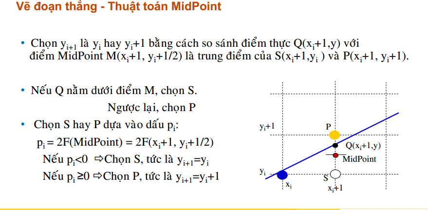

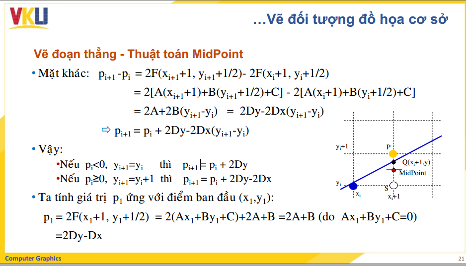

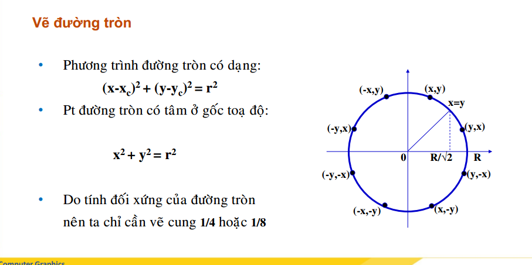

```c
#include <GL/glut.h>

#include <math.h>

#include <stdlib.h>

int ww = 800, wh = 800;

int first = 0;

int xi, yi, xf, yf;

void putpixel(int x, int y) {
  glColor3f(0.3, 0.2, 0.0); 
  glBegin(GL_POINTS);
  glVertex2i(x, y);    
  glEnd();
  glFlush(); 
}
void Bres_Circle(int r){
    int x,y,p;
    x=0;y=r;p=3-2*r;
    while(x<=y){
        putpixel(150+x,150+y);
        putpixel(150-x,150+y);
        putpixel(150-x,150-y);
        putpixel(150+x,150-y);
        putpixel(150+y,150+x);
        putpixel(150+y,150-x);
        putpixel(150-y,150+x);
        putpixel(150-y,150-x);
        if(p<0) p+=4*x+6;
        else{
            p+=4*(x-y)+10;
            y--;
        }
        x++;
    }
}
void MidPoint_Circle(int r){
  int x=0,y=r,p=3-2*r;
  while(x<=y){
    putpixel(150+x,150+y);
    putpixel(150-x,150+y);
    putpixel(150-x,150-y);
    putpixel(150+x,150-y);
    putpixel(150+y,150+x);
    putpixel(150+y,150-x);
    putpixel(150-y,150+x);
    putpixel(150-y,150-x);

    if(p<0)
      p=p+2*x+3;
    else{
      p=p+2*(x-y)+5;
      y--;
    }  
    x++;
  }
}
void display() {
  glClearColor(0.4, 0.7, 0.5, 1.0);
  glColor3f(0.2, 0.3, 0.3);
  glClear(GL_COLOR_BUFFER_BIT);
  glFlush();
}


void mouse(int btn, int state, int x, int y) {

  if (btn == GLUT_LEFT_BUTTON && state == GLUT_DOWN)

  {
    xi=0;
    yi=y;
    MidPoint_Circle(yi);
  }
  if(btn == GLUT_RIGHT_BUTTON && state == GLUT_DOWN){
  	xi=0;
    yi=y;
    Bres_Circle(yi);
  }
}

void myinit() {
  glViewport(0, 0, ww, wh);
  glMatrixMode(GL_PROJECTION);
  glLoadIdentity();
  gluOrtho2D(0.0, (GLdouble) ww, 0.0, (GLdouble) wh);
  glMatrixMode(GL_MODELVIEW);
}
int main(int argc, char ** argv) {
  glutInit( & argc, argv);
  glutInitDisplayMode(GLUT_SINGLE | GLUT_RGB);
  glutInitWindowSize(ww, wh);
  glutCreateWindow("Lab2: Midpoinr Circle Algorithm");
  glutDisplayFunc(display);
  myinit();
  glutMouseFunc(mouse);
  glutMainLoop();
  return 0;
}
```

### 1.3.Thuật toán vẽ ellipse

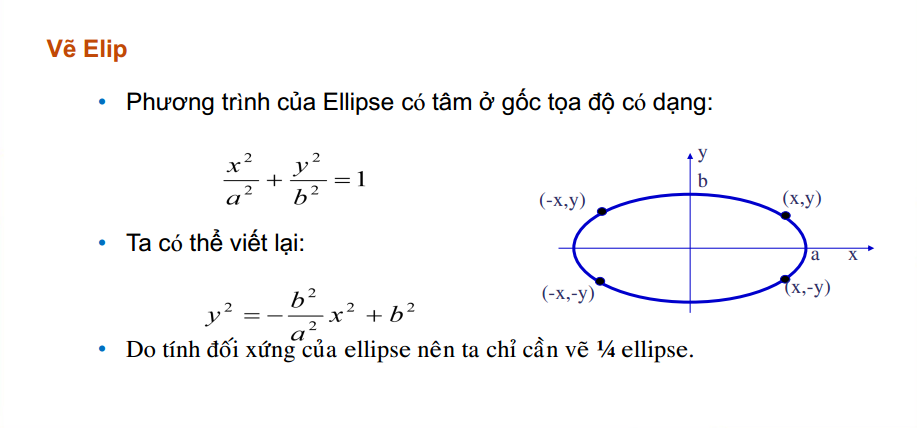

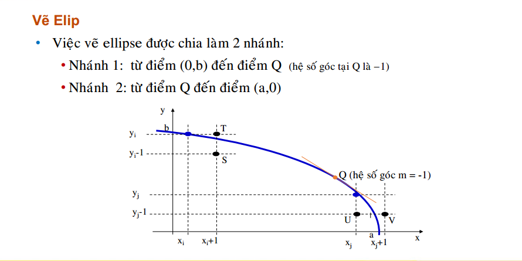

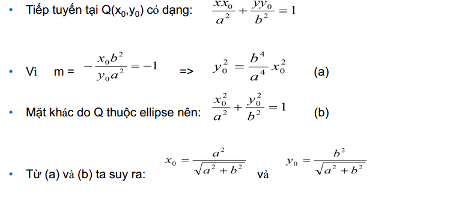

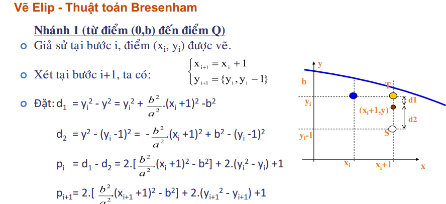

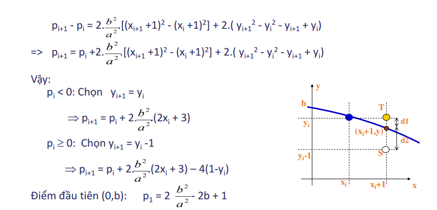

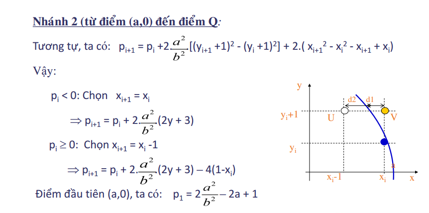

```c
#include <GL/glut.h>
#include <math.h>  
#include <stdio.h>
#include <iostream>
using namespace std;
bool first = true;
int X1 = -1, X2 = -1 , Y1 = -1, Y2 =-1 ;
int my_a,my_b;
void Ve4diem(int xc,int yc,int x, int y)
{
	glColor3f(1.0, 0.0, 0.0);
	glBegin(GL_POINTS);
    glVertex3i(xc+x,yc+y,0);
    glVertex3i(xc-x,yc+y,0);
    glVertex3i(xc-x,yc-y,0);
    glVertex3i(xc+x,yc-y,0);
	glEnd();
	glFlush();
}
float tinhKhoangCach(int x1, int y1, int x2, int y2){
	return sqrt( (x2 - x1)* (x2 - x1) + (y2 - y1)* (y2 - y1) );
}

void veEllip(int xtam, int ytam, int a, int b){
	float p , a2 , b2;
	int x,y;
	a2 = a*a;
	b2 = b*b;
	x = 0 ;
	y = b;
	p=2*((float)b2/a2)-(2*b)+1;//d1-d2
	//ve nhanh tu tren xuong
	while(((float)b2/a2)*x <= y ){
		Ve4diem(xtam, ytam, x ,y);
		if (p < 0){
			p = p + 2* ((float)b2/a2) *(2*x + 3);
		}else {
			p = p - 4*y + 2*((float)b2/a2) * (2*x +3);
			y--;
		}
		x++;
	}
	//ve nhanh tu duoi len
	y = 0;
	x = a;	
	p=2*((float)a2/b2)-2*a+1;
	while(((float)a2/b2)*y<=x)
    {
        Ve4diem(xtam,ytam,x,y);
        if(p<0)
        {
            p=p +2*((float)a2/b2)*(2*y+3);
        }
        else
        {
            p=p- 4*x + 2*((float)a2/b2)*(2*y+3);
            x=x-1;
        }
        y=y+1;
    }
    
    
}
void mouse(int button, int state , int x , int y) {	
	int mousex = x ;
	int mousey = 600-y;	
		switch(button){
		case GLUT_LEFT_BUTTON:
			if (state == GLUT_DOWN) {
			if (first == true ){
			X1 = mousex ;
			Y1 = mousey;
			glBegin(GL_POINTS);
    		glVertex2f(X1,Y1);
			glEnd();
			veEllip(X1,Y1,my_a,my_b);	
			break;
			}
		}
		case GLUT_RIGHT_BUTTON:
			if (state == GLUT_DOWN) {
			glClear(GL_COLOR_BUFFER_BIT ); 
			glColor3f(1.0, 0.0, 0.0);				
		 	glFlush();
			break;
			}
		}
}


void display(){
	glClear(GL_COLOR_BUFFER_BIT);
	glClearColor(1.0 ,1.0,1.0,1.0);
	glColor3f(1.0, 0.0, 0.0);
	glOrtho(0 , 600, 0, 600 , -1.0 , 1.0);
	glFlush(); 
}


int main(){
	cout << "Nhap a (vd: 120): "; cin>>my_a;
    cout << "Nhap b (vd: 30):";cin>>my_b;
	glutInitDisplayMode (GLUT_SINGLE | GLUT_RGB);
	glutInitWindowSize (600, 600); 
	glutInitWindowPosition (0, 0);
	glutCreateWindow("VE ELLIP BRE");
	glColor3f(1.0, 1.0, 1.0); 
	glutDisplayFunc(display);			
	glutMouseFunc(mouse);	
	glutMainLoop();		
}


```

**Ve bang middpoint**

```c
#include <GL/glut.h>
#include <math.h>  
bool first = true;
int X1 = -1, X2 = -1 , Y1 = -1, Y2 =-1 ;
void Ve4diem(int xc,int yc,int x, int y)
{
	glColor3f(1.0, 0.0, 0.0);
	glBegin(GL_POINTS);
    glVertex3i(xc+x,yc+y,0);
    glVertex3i(xc-x,yc+y,0);
    glVertex3i(xc-x,yc-y,0);
    glVertex3i(xc+x,yc-y,0);
	glEnd();
	glFlush();
}
float tinhKhoangCach(int x1, int y1, int x2, int y2){
	return sqrt( (x2 - x1)* (x2 - x1) + (y2 - y1)* (y2 - y1) );
}

void veEllip(int xtam, int ytam, int a, int b){
 int x, y, fx, fy, a2, b2, p,x0,y0;
    x = 0;
    y = b;
    a2 = a*a;
    b2 = b*b;
    fx = 0;
    fy = 2 * a2 * y;   
    Ve4diem(xtam ,ytam, x, y);
    x0=(int)(a2/sqrt(a2+b2));
    y0=(int)(b2/sqrt(a2+b2));
    p=b2 - a2*b +a2/4 ; //p1 tai(o,b)
    while(x<=x0)
    {
        Ve4diem(xtam, ytam, x, y);
        if (p<0) p+=(2*x+3)*b2;
        else{ p+=(2*x+3)*b2-2*a2*(y-1);
			y--;
		}
        x++;
    }
    //p = b2*(x +0.5)*(x +0.5) + a2*(y-1)*(y-1) - a2*b2;
	x=a; y=0; p=a2-a*b2+(1/4)*b2;
    while(y<=y0)
    {
        Ve4diem(xtam, ytam, x, y);
        if (p<0) p+=a2*(2*y+3);
        else{ p+=(2*y+3)*a2-2*b2*(x-1);
			x--;
          }
        y++;
    }
    
    
}
void mouse(int button, int state , int x , int y) {	
	int mousex = x ;
	int mousey = 600-y;
		switch(button){
		case GLUT_LEFT_BUTTON:
			if (state == GLUT_DOWN) {
			if (first == true ){
			X1 = mousex ;
			Y1 = mousey;
			first = false;
			break;
			}
			else {
			X2 = mousex;
			Y2 = mousey;
			first = true ;
			glBegin(GL_POINTS);
    		glVertex2f(X1,Y1);
    		//glVertex2f(X2,Y2);
			glEnd();
			float s = tinhKhoangCach(X1, Y1, X2, Y2);
			veEllip(X1,Y1,s,30);	
			break;
			}
		}
		case GLUT_RIGHT_BUTTON:
			if (state == GLUT_DOWN) {
			glClear(GL_COLOR_BUFFER_BIT ); 
			glColor3f(1.0, 0.0, 0.0);				
		 	glFlush();
			break;
			}
		}
}


void display(){
	glClear(GL_COLOR_BUFFER_BIT);
	glColor3f(1.0, 0.0, 0.0);
	glOrtho(0 , 600, 0, 600 , -1.0 , 1.0);
	glFlush(); 
}


int main(){
	glutInitDisplayMode (GLUT_SINGLE | GLUT_RGB);
	glutInitWindowSize (600, 600); 
	glutInitWindowPosition (0, 0);
	glutCreateWindow("VE ELLIP MID POINT");
	glColor3f(0.0, 0.0, 0.0); 
	glutDisplayFunc(display);			
	glutMouseFunc(mouse);
	glutMainLoop();
		
}


```


### 1.4.Vẽ các đường cong khác


